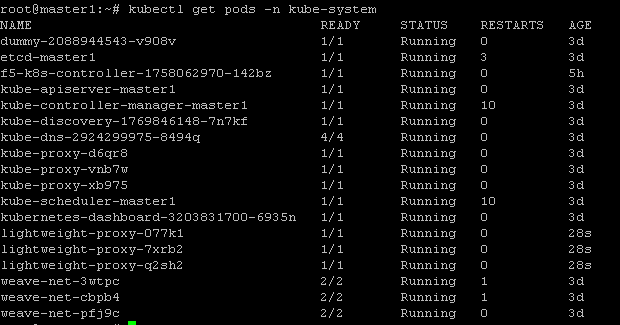
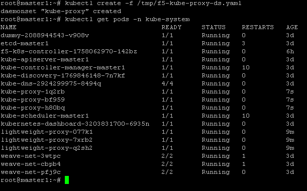

F5 ASP and kube-proxy Deployment
================================

To use ASP, we will need to add a Application Services Proxy Instance to Every Node

Every node in the cluster need to run an instance of ASP. The steps below demonstrate how to use a Kubernetes ConfigMap and DaemonSet to run one Application Services Proxy per node and apply the same configurations to each ASP instance.

The DaemonSet ensures one Application Services Proxy runs per node in the Kubernetes cluster. The ConfigMap contains the configurations you want to apply to each LWP instance.

The first step will be to load the relevant F5 container images into our system. 

Load images
-----------

We need to deploy a ASP instance on every node. Please do the following steps on **all systems** (because we don't use a docker registry)

::

	cd /root/

	gunzip f5-kube-proxy-v1.3.7_f5.1.tar.gz

	gunzip light-weight-proxy-v0.2.0.tar.gz

	docker load -i light-weight-proxy-v0.2.0.tar

	docker load -i f5-kube-proxy-v1.3.7_f5.1.tar

Once you have loaded the images in docker, you may ensure it got loaded properly by running the following command: 

::

	docker images

.. image:: ../images/f5-asp-and-kube-proxy-load-f5-containers.png
	:align: center

Now that our images are loaded, we can deploy the ASP image

Deploy ASP 
----------

To deploy ASP, we will need to load several configuration into our Kubernetes solution:

* A configmap: The ConfigMap contains the configurations you want to apply to each LWP instance.
* A daemonset: The DaemonSet ensures one Application Services Proxy runs per node in the Kubernetes cluster. 

To setup those components, connect to the **master** and do the following: 

create a yaml file called *f5-asp-configmap.yaml* and here is the content to copy/paste into it. 

::

	kind: ConfigMap
	apiVersion: v1
	metadata:
	  name: lwp-config
	  namespace: kube-system
	data:
	  lightweight-proxy.config.json: |-
	    {
	      "global": {
	        "console-log-level": "info"
	      },
	      "orchestration": {
	        "kubernetes": {
	          "config-file": "/var/run/kubernetes/proxy-plugin/service-ports.json",
	          "poll-interval": 500
	        }
	      }
	    }

Once the configmap file is done, we can setup the daemonset file. Create a file called *f5-asp-daemonset.yaml* and here is the content to copy/paste into it. 

::

	apiVersion: extensions/v1beta1
	kind: DaemonSet
	metadata:
	  name: lightweight-proxy
	  namespace: kube-system
	spec:
	  template:
	    metadata:
	      labels:
	        name: lightweight-proxy
	    spec:
	      hostNetwork: true
	      containers:
	        - name: proxy-plugin
	          image: f5networks/f5-ci-beta:light-weight-proxy-v0.2.0
	          args:
	            - --config-file
	            - /etc/configmap/lightweight-proxy.config.json
	          securityContext:
	            privileged: false
	          volumeMounts:
	          - mountPath: /var/run/kubernetes/proxy-plugin
	            name: plugin-config
	            readOnly: true
	          - mountPath: /etc/configmap
	            name: lwp-config
	      volumes:
	        - name: plugin-config
	          hostPath:
	            path: /var/run/kubernetes/proxy-plugin
	        - name: lwp-config
	          configMap:
	            name: lwp-config

Once our files are created, we can use them to create the relevant ConfigMap and Daemonset to start our ASP instances. 

On the **master**, run the following commands: 

:: 

	kubectl create -f f5-asp-configmap.yaml

	kubectl create -f f5-asp-daemonset.yaml

Here the ASP should be deployed automatically. You should have as many ASP instances launched as nodes you have in your kubernetes cluster (in the UDF blueprint, it's three - 3). You can validate this with the following commands: 

::

	kubectl get pods -n kube-system

The ASP are deployed. Now we need to update the kube-proxy with the F5-kube-proxy instances so that we can leverage our ASP

Deploy f5-kube-proxy
--------------------

Right now, we have a Daemonset that is used to deploy the default kube-proxy. We will retrieve it to delete the existing instances. 

To retrieve the kube-proxy daemonset config, run the following command to review its configuration: 

::

	kubectl edit ds kube-proxy -n kube-system

It should launch a VI editor, save the configuration with the following command in vi :

::

	:w /tmp/kube-proxy-origin.yaml

Now we can create our new daemonset to launch the F5-kube-proxy. create a new deamonset yaml called *f5-kube-proxy-ds.yaml*

::

	vi  /tmp/f5-kube-proxy-ds.yaml

Here is the content of the file, copy/paste it. 

::

	# Please edit the object below. Lines beginning with a '#' will be ignored,
	# and an empty file will abort the edit. If an error occurs while saving this file will be
	# reopened with the relevant failures.
	#
	apiVersion: extensions/v1beta1
	kind: DaemonSet
	metadata:
	  annotations:
	    kubectl.kubernetes.io/last-applied-configuration: '{"apiVersion":"extensions/v1beta1","kind":"DaemonSet","metadata":{"annotations":{},"creationTimestamp":"2017-01-31T10:43:01Z","generation":3,"labels":{"component":"kube-proxy","k8s-app":"kube-proxy","kubernetes.io/cluster-service":"true","name":"kube-proxy","tier":"node"},"name":"kube-proxy","namespace":"kube-system","resourceVersion":"278413","selfLink":"/apis/extensions/v1beta1/namespaces/kube-system/daemonsets/kube-proxy","uid":"09f08c86-e7a2-11e6-b1ea-525400ce18b9"},"spec":{"selector":{"matchLabels":{"component":"kube-proxy","k8s-app":"kube-proxy","kubernetes.io/cluster-service":"true","name":"kube-proxy","tier":"node"}},"template":{"metadata":{"annotations":{"scheduler.alpha.kubernetes.io/affinity":"{\"nodeAffinity\":{\"requiredDuringSchedulingIgnoredDuringExecution\":{\"nodeSelectorTerms\":[{\"matchExpressions\":[{\"key\":\"beta.kubernetes.io/arch\",\"operator\":\"In\",\"values\":[\"amd64\"]}]}]}}}","scheduler.alpha.kubernetes.io/tolerations":"[{\"key\":\"dedicated\",\"value\":\"master\",\"effect\":\"NoSchedule\"}]"},"creationTimestamp":null,"labels":{"component":"kube-proxy","k8s-app":"kube-proxy","kubernetes.io/cluster-service":"true","name":"kube-proxy","tier":"node"}},"spec":{"containers":[{"command":["/proxy","--kubeconfig=/run/kubeconfig"],"image":"f5networks/f5-ci-beta:f5-kube-proxy-v1.3.7_f5.1","imagePullPolicy":"IfNotPresent","name":"kube-proxy","resources":{},"securityContext":{"privileged":true},"terminationMessagePath":"/dev/termination-log","volumeMounts":[{"mountPath":"/var/run/dbus","name":"dbus"},{"mountPath":"/run/kubeconfig","name":"kubeconfig"},{"mountPath":"/var/run/kubernetes/proxy-plugin","name":"plugin-config"}]}],"dnsPolicy":"ClusterFirst","hostNetwork":true,"restartPolicy":"Always","securityContext":{},"terminationGracePeriodSeconds":30,"volumes":[{"hostPath":{"path":"/etc/kubernetes/kubelet.conf"},"name":"kubeconfig"},{"hostPath":{"path":"/var/run/dbus"},"name":"dbus"},{"hostPath":{"path":"/var/run/kubernetes/proxy-plugin"},"name":"plugin-config"}]}}},"status":{"currentNumberScheduled":3,"desiredNumberScheduled":3,"numberMisscheduled":0,"numberReady":3}}'
	  creationTimestamp: 2017-02-02T14:12:27Z
	  generation: 1
	  labels:
	    component: kube-proxy
	    k8s-app: kube-proxy
	    kubernetes.io/cluster-service: "true"
	    name: kube-proxy
	    tier: node
	  name: kube-proxy
	  namespace: kube-system
	  resourceVersion: "279250"
	  selfLink: /apis/extensions/v1beta1/namespaces/kube-system/daemonsets/kube-proxy
	  uid: a0917852-e951-11e6-b1ea-525400ce18b9
	spec:
	  selector:
	    matchLabels:
	      component: kube-proxy
	      k8s-app: kube-proxy
	      kubernetes.io/cluster-service: "true"
	      name: kube-proxy
	      tier: node
	  template:
	    metadata:
	      annotations:
	        scheduler.alpha.kubernetes.io/affinity: '{"nodeAffinity":{"requiredDuringSchedulingIgnoredDuringExecution":{"nodeSelectorTerms":[{"matchExpressions":[{"key":"beta.kubernetes.io/arch","operator":"In","values":["amd64"]}]}]}}}'
        	scheduler.alpha.kubernetes.io/tolerations: '[{"key":"dedicated","value":"master","effect":"NoSchedule"}]'
	      creationTimestamp: null
	      labels:
	        component: kube-proxy
	        k8s-app: kube-proxy
	        kubernetes.io/cluster-service: "true"
	        name: kube-proxy
	        tier: node
	    spec:
	      containers:
	      - command:
	        - /proxy
	        - --kubeconfig=/run/kubeconfig
	        image: f5networks/f5-ci-beta:f5-kube-proxy-v1.3.7_f5.1
	        imagePullPolicy: IfNotPresent
	        name: kube-proxy
	        resources: {}
	        securityContext:
	          privileged: true
	        terminationMessagePath: /dev/termination-log
	        volumeMounts:
	        - mountPath: /var/run/dbus
	          name: dbus
	        - mountPath: /run/kubeconfig
	          name: kubeconfig
	        - mountPath: /var/run/kubernetes/proxy-plugin
	          name: plugin-config
	      dnsPolicy: ClusterFirst
	      hostNetwork: true
	      restartPolicy: Always
	      securityContext: {}
	      terminationGracePeriodSeconds: 30
	      volumes:
	      - hostPath:
	          path: /etc/kubernetes/kubelet.conf
	        name: kubeconfig
	      - hostPath:
	          path: /var/run/dbus
	        name: dbus
	      - hostPath:
	          path: /var/run/kubernetes/proxy-plugin
	        name: plugin-config
	status:
	  currentNumberScheduled: 3
	  desiredNumberScheduled: 3
	  numberMisscheduled: 0
	  numberReady: 3

Now that we have the legacy ds config and the updated one, we can delete the existing kube-proxy ds with the following command:

:: 

	kubectl delete -f /tmp/kube-proxy-origin.yaml

You can check that the kube-proxy instances have been removed from Kubernetes with the following command

::

	kubectl get pods -n kube-system

.. image:: ../images/f5-asp-and-kube-proxy-delete-origin-kube-proxy.png
	:align:	center

We can deploy the updated daemonset: 

::

	kubectl create -f /tmp/f5-kube-proxy-ds.yaml
 
You can check that the deployment was successful with the command: 

::

	kubectl get pods -n kube-system

