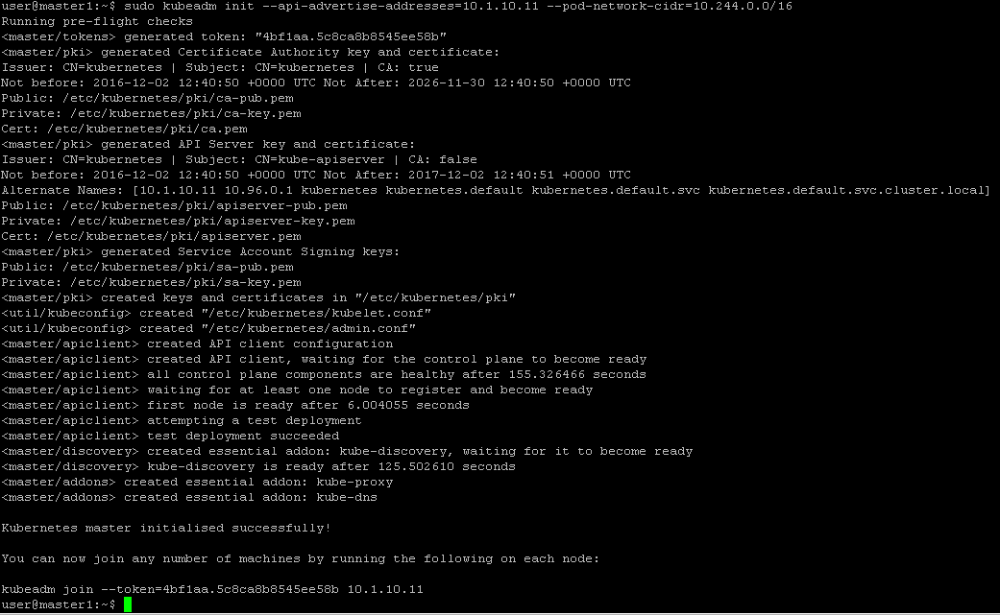

Setup master
============

Master initialization
---------------------

The master is the system where the "control plane" components run, including etcd (the cluster database) and the API server (which the kubectl CLI communicates with). All of these components run in pods started by kubelet (which is why we had to setup docker first even on the master node)

we will setup our master node on **master1**, connect to it.

to setup **master1** as a Kubernetes *master*, run the following command:

::

	kubeadm init --api-advertise-addresses=10.1.10.11 --pod-network-cidr=10.244.0.0/16

Here we specify:

* The IP address that should be used to advertise the master. 10.1.10.0/24 in the UDF blueprint is the network for our controle plane. if you don't specify the --api-advertise-addresses argument, kubeadm will pick the first interface with a default gateway (because it needs internet access). 

* The pod network CIDR which will be used by Flannel. It will be used to allow network ranges to each *node*. This should be a minimum of a /16 so controller-manager is able to assign /24 subnets to each *node* in the cluster. The subnet specified is the default one when loading Fannel in a *pod*. If you want to use another CIDR, you'll have to update also the Flannel manifest
  
When running the command you should see something like this:

The initialization is successful if you see "Kubernetes master initialised successfully!"

you should see a line like this:

::

	kubeadm join --token=4bf1aa.5c8ca8b8545ee58b 10.1.10.11

This is the command to run on the node so that it registers itself with the master. Keep the secret safe since anyone with this token can add authenticated node to your cluster. This is used for mutual auth between the master and the nodes

.. warning::

	**save this command somewhere since you'll need it later**

Network pod
-----------

You must install a *pod* network add-on so that your *pods* can communicate with each other.

**It is necessary to do this before you try to deploy any applications to your cluster**, and before* kube-dns* will start up. Note also that *kubeadm* only supports CNI based networks and therefore kubenet based networks will not work.

Here is the list of add-ons available:

* Calico
* Canal 
* Flannel 
* Romana
* Weave net

We will use Flannel as mentioned previously. To deploy Flannel, you'll need to specify a yaml file containing the pod definition. By default this yaml file is available here: `Flannel manifest <https://github.com/coreos/flannel/blob/master/Documentation/kube-flannel.yml>`_

Copy/paste this file via the command (make sure to copy the --- on the first line ! ): 

::

	vi /home/user/kube-flannel.yml

once you have copied the file: 

::

	kubectl apply -f kube-flannel.yml

you should see something like this: 

::

	*configmap "kube-flannel-cfg" created*
	*daemonset "kube-flannel-ds" created*

ETCD setup
----------

kubeadm will setup by default etcd to listen only on 127.0.0.1. 

etcd will be start automatically as a container. This is done by setting up a manifest in /etc/kubernestes/manifests. The related file is etcd.json. 

edit this file and replace

::

	"--listen-client-urls=http://127.0.0.1:2379",
    "--advertise-client-urls=http://127.0.0.1:2379",

with

::

	"--listen-client-urls=http://127.0.0.1:2379,http://10.1.10.11:2379",
    "--advertise-client-urls=http://10.1.10.11:2379",

This way etcd will listen on all the IP addresses available on this node

once the update is done you can restart your docker container running etcd with :

::

	sudo docker run ps 

Check the container ID of your etcd container and run:

::

	sudo docker restart <container ID>

kube-controller-manager setup
-----------------------------

edit **/etc/kubernetes/manifests/kube-controller-manager.json** 

change this line :

::

	"--address=127.0.0.1",

to 

::

	 "--address=0.0.0.0",

kube-apiserver setup
--------------------

edit **/etc/kubernetes/manifests/kube-apiserver.json** and replace: 

::
	
	"--insecure-bind-address=127.0.0.1",

with 

::

	 "--insecure-bind-address=0.0.0.0",

kube-apiserver setup
--------------------

edit **/etc/kubernetes/manifests/kube-scheduler.json** and replace: 

::
	
	"--address=127.0.0.1",

with 

::

	 "--address=0.0.0.0,

check master state 
------------------

If everything runs as expected you should have kube-dns that started successfully. To check the status of the different service, you can run the command:

::

	kubectl get pods --all-namespaces

The output looks like this 

.. image:: ../images/cluster-setup-guide-kubeadm-check-pods.png
	:align: center

the next step will be to have our *nodes* join the *master*

 kubectl get pods --all-namespaces
kubectl get cs
kubectl cluster-info
