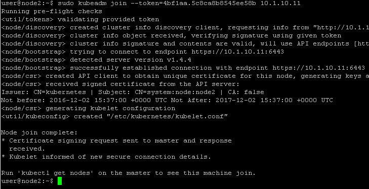
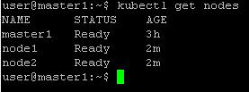

Node setup
==========

Once the master is setup and running, we need to connect our *nodes* to it. 

Setup Kubelet
-------------

by default kubelet will define its *Node IP* based on its name resolution. If it fails, it will use the first interface. However on a system with multiple interfaces, you may want to force a specific IP to be used. 

to force a specific IP address to be used, you can edit **/etc/systemd/system/kubelet.service.d/10-kubeadm.conf** and edit the following line:

::

	Environment="KUBELET_NETWORK_ARGS=--network-plugin=cni --cni-conf-dir=/etc/cni/net.d --cni-bin-dir=/opt/cni/bin"

add the following arg to it: --node-ip=<IP>

for *node1*, this should look like: 

::

	Environment="KUBELET_NETWORK_ARGS=--network-plugin=cni --cni-conf-dir=/etc/cni/net.d --cni-bin-dir=/opt/cni/bin --node-ip=10.1.20.21"

for *node2*, this should look like:

::

	Environment="KUBELET_NETWORK_ARGS=--network-plugin=cni --cni-conf-dir=/etc/cni/net.d --cni-bin-dir=/opt/cni/bin --node-ip=10.1.20.22"

if you want to review all *kubelet* options, you may check this link: `Kubelet <http://kubernetes.io/docs/admin/kubelet/>`_

Join the master
---------------

to join the master we need to run the command highlighted during the master initialization. In our setup it was:

::

	kubeadm join --token=4bf1aa.5c8ca8b8545ee58b 10.1.10.11

run the command you got (**not the example above**) with sudo on **your nodes** (node1 and node2 with UDF blueprint):

::

	sudo kubeadm join --token=4bf1aa.5c8ca8b8545ee58b 10.1.10.11

the output should be like this :

to make sure that your *nodes* have joined, you can run this command on the *master*:

::

	 kubectl get nodes

You should see your cluster (ie *master* + *nodes*)

