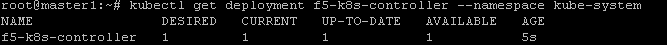
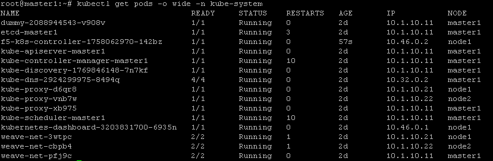
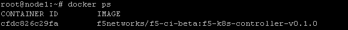
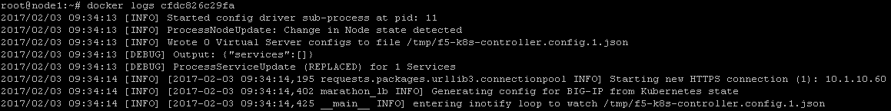

Container Connector(CC) Setup
=============================

the official CC documentation is here: `Install the F5 Kubernetes BIG-IP Controller <http://clouddocs.f5.com/containers/v1/kubernetes/kctlr-app-install.html>`_

BIG-IP setup
------------

To use F5 Container connector, you'll need a BIG-IP up and running first. 

In the UDF blueprint, you should have a BIG-IP available at the following URL: https://10.1.10.60

Connect to your BIG-IP and check it is active and licensed. Its login and password are: admin/admin

You need to setup a partition that will be used by CC. 

To do so go to : System > Users > Partition List. Create a new partition called "kubernetes"

.. image:: ../images/f5-container-connector-bigip-partition-setup.png
	:align: center

Once your partition is created, we can go back to Kubernetes to setup the F5 Container connector

Container Connector deployment
------------------------------

Here we consider you have already retrieved the F5 container connector image and loaded it in the environment. **If you use the UDF blueprint it's already loaded in our private registry 10.1.10.11:5000 (10.1.10.11:5000/k8s-bigip-ctlr:v1.0.0)**.

If you haven't loaded it in your environment, you need to :

* load it on **all your systems** with the docker load -i <file_name.tar> 
* load it on a system and push it into your registry

Now that our container is loaded, we need to define a deployment: `Kubernetes deployments <https://kubernetes.io/docs/user-guide/deployments/>`_ and create a secret to hide our bigip credentials. `Kubernetes secrets <https://kubernetes.io/docs/user-guide/secrets/>`_

On the **master**, we need to setup a deployment file to load our container and also setup a secret for our big-ip credentials

to setup the secret containing your BIG-IP login and password, you can run the following command:

::

	kubectl create secret generic bigip-login --namespace kube-system --from-literal=username=admin --from-literal=password=admin

you should see something like this: 

.. image:: ../images/f5-container-connector-bigip-secret.png
	:align: center

create a file called f5-cc-deployment.yaml. Here is its content:

::

	apiVersion: extensions/v1beta1
	kind: Deployment
	metadata:
	  name: k8s-bigip-ctlr-deployment
	  namespace: kube-system
	spec:
	  replicas: 1
	  template:
	    metadata:
	      name: k8s-bigip-ctlr
	      labels:
	        app: k8s-bigip-ctlr
	    spec:
	      containers:
	        - name: k8s-bigip-ctlr
	          image: "10.1.10.11:5000/k8s-bigip-ctlr:v1.0.0"
	          env:
	            - name: BIGIP_USERNAME
	              valueFrom:
	                secretKeyRef:
	                  name: bigip-login
	                  key: username
	            - name: BIGIP_PASSWORD
	              valueFrom:
	                secretKeyRef:
	                  name: bigip-login
	                  key: password
	          command: ["/app/bin/k8s-bigip-ctlr"]
	          args: [
	            "--bigip-username=$(BIGIP_USERNAME)",
	            "--bigip-password=$(BIGIP_PASSWORD)",
	            "--bigip-url=10.1.10.60",
	            "--bigip-partition=kubernetes",
	            "--namespace=default",
	          ]

if you don't use the UDF blueprint, you need to update the field *image* with the appropriate path to your image. 

If you have issues with your yaml and syntax (**identation MATTERS**), you can try to use an online parser to help you : `Yaml parser <http://www.yamllint.com/>`_

Once you have your yaml file setup, you can try to launch your deployment. It will start our f5-k8s-controller container on one of our node: 

::

	kubectl create -f f5-cc-deployment.yaml

	kubectl get deployment f5-k8s-controller --namespace kube-system

FYI, To locate on which node the container connector is running, you can use the following command: 

:: 

	kubectl get pods -o wide -n kube-system

We can see that our container is running on node1. 

If you need to troubleshoot your container, you'll need to identify on which node it runs and use docker logs command: 

On **node1** (or another node depending on the previous command): 

:: 

	docker ps 

Here we can see our container ID: cfdc826c29fa

Now we can check our container logs: 

:: 

	docker logs cfdc826c29fa

