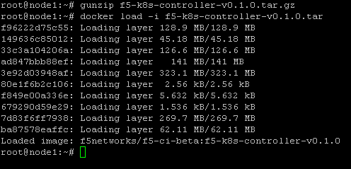
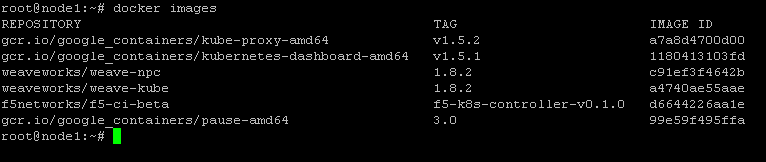

Container Connector(CC)
=======================

BIG-IP setup
------------

To use F5 Container connector, you'll need a BIG-IP up and running first. 

In the UDF blueprint, you should have a BIG-IP available at the following URL: https://10.1.10.60

Connect to your BIG-IP and check it is active and licensed. 

You need to setup a partition that will be used by CC. 

To do so go to : System > Users > Partition List. Create a new partition called "kubernetes"

.. image:: ../images/f5-container-connector-bigip-partition-setup.png
	:align: center

Once your partition is created, we can go back to Kubernetes to setup the F5 Container connector

Container Connector deployment
------------------------------

Here we consider you have already retrieved F5 container package. In our example, it is called: f5-k8s-controller-v0.1.0.tar.gz

The first thing to do is to load this container in our docker images repository. 

Since we haven't setup a docker registry, we will need to load the image on **all systems**. If you want to setup a registry, you can review the process here: `Setup a docker registry <https://docs.docker.com/registry/deploying/>`_

Do the following on **all systems** (in UDF, the CC container archive is in /root/ - you need to be root or use sudo for docker commands):

::

	cd /root/
	gunzip f5-k8s-controller-v0.1.0.tar.gz
	docker load -i f5-k8s-controller-v0.1.0.tar

Once you have loaded the image on *all systems*, check that the image is available 

::

	docker images

Now that our container is loaded, we need to define a deployment. `Kubernetes deployments <https://kubernetes.io/docs/user-guide/deployments/>`_

On the **master**, create a file called f5-cc-deployment.yaml. Here is its content:

::

	# Sample configuration for f5-k8s-controller. BIG-IP configuration is pulled
	# from the secret store and passed to the controller.
	apiVersion: extensions/v1beta1
	kind: Deployment
	metadata:
	  name: f5-k8s-controller
	  namesapce: kube-system
	spec:
	  replicas: 1
	  template:
	    metadata:
	      name: f5-k8s-controller
	      labels:
	        app: f5-k8s-controller
	    spec:
	      containers:
	        - name: f5-k8s-controller
	          # Specify the path to your image here
	          image: "f5networks/f5-ci-beta:f5-k8s-controller-v0.1.0"
	          command: ["/app/bin/f5-k8s-controller"]
	          args: ["--running-in-cluster=true",
	            "--bigip-url=10.1.10.60",
	            "--bigip-username=admin",
	            "--bigip-password=admin"
	          ]

if you setup a registry, you need to update the field *image* with the appropriate path to your image. For your information it is possible to hide the login/password by setting up secret in Kubernetes `Kubernetes secrets <https://kubernetes.io/docs/user-guide/secrets/>`_

