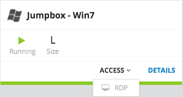

.. _access_udf:

Connecting to UDF
=================

We consider that you have access to UDF for the different labs. 

This guide will help you to either setup your own environment or leverage F5 UDF (you must be a F5 employee) to learn about this. 

Create your environment
-----------------------

If you want to setup your own kubernetes environment, you need to create your own deployment reflecting what has been explained in the previous section. Please go to the Cluster setup guide to do this: :ref:`my-cluster-setup`

Start your environment
----------------------

Connect to UDF and go to deployment. 

Select the relevant blueprint based on your need: A standalone Kubernetes deployment (1 master, 2 nodes), find the '[Kubernetes] how to setup ASP and CC (Velcro)' blueprint and deploy it

.. warning:: 

   With this blueprint, you don't have to do the cluster setup guide

==================  ====================  ====================  ============  =============================================
     Hostname           Management IP        Kubernetes IP          Role                 Login/Password
==================  ====================  ====================  ============  ============================================
     Master 1             10.1.1.4            10.1.10.11          Master       ssh: ubuntu/<your key> - su : root/default           
      node 1              10.1.1.5            10.1.10.21           node        ssh: ubuntu/<your key> - su : root/default
      node 2              10.1.1.6            10.1.10.22           node        ssh: ubuntu/<your key> - su : root/default
     Windows                10.1.1.7            10.1.10.50        Jumpbox            administrator / &NUyBADsdo
==================  ====================  ====================  ============  =============================================

There is also a docker registry available to centralize our images. it's accessible via 10.1.10.11:5000

Access your environment
-----------------------

If you deployed the existing blueprint mentioned above; Once your environment is started, find the 'Jumpbox' component under 'Components' and launch RDP (in the ACCESS menu)

Click on the shortcut that got downloaded and it should open your RDP session. The credentials to use are administrator/&NUyBADsdo.

*If you have trouble reading the text please see optional directions for changing text size in the Appendix.*

.. warning:: For MAC user, it is recommended to use Microsoft Remote Desktop. You may not be able to access your jumpbox otherwise. It is available in the App store (FREE).
   

.. topic:: Change keyboard input

   The default keyboard mapping is set to english. If you need to change it, here is the method
   
   * Click on the start menu button and type 'Language' in the search field.
   * Click on 'Language' option in the search list
   
   .. image:: ../images/select-region-language.png
      :scale: 50 %
      :align: center

   * Click on 'Add a language' 
   
   .. image:: ../images/select-change-keyboard.png
      :scale: 50 %
      :align: center

   * Add the language you want to have for your keyboard mapping. 

Once you have access to your environment, you can go directly to the container connector section: :ref:`container-connector`
